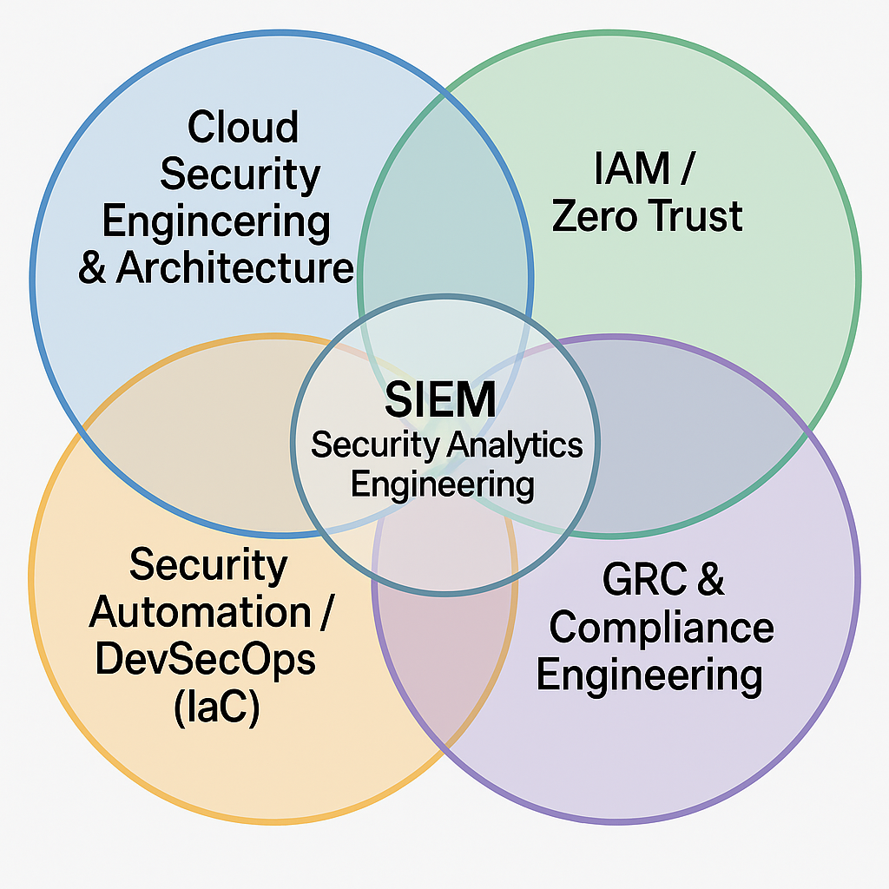

# 🛡️ Cloud-Native Cybersecurity Engineer

I’m a cybersecurity engineer specializing in **Cloud Security Architecture**, **Security Automation / DevSecOps (IaC)**, **IAM / Zero Trust**, **SIEM & Analytics**, and **GRC & Compliance Engineering**. My focus is on building secure, automated, auditable environments across hybrid and multi-cloud systems using tools like **Terraform**, **Microsoft Sentinel**, **AWS Security Hub**, **Entra ID**, and more.

# About Me
With a background in full-stack IT and experience as the sole IT and security owner for a remote-first company, I’ve architected, deployed, and operationalized cloud-native security programs from the ground up. This portfolio provides a holistic view of my work, impact, and the secure-by-design systems I continue to build.

--- 

## ⚙️ What I Do

- **Cloud Security Engineering & Architecture**  
  Designing secure infrastructure across Azure and AWS using IaC, Zero Trust, and security-first architecture patterns.

- **Security Automation / DevSecOps (IaC)**  
  Automating everything from asset deployment to compliance validation using Terraform, pipelines, and policy-as-code.

- **IAM / Zero Trust Engineering**  
  Implementing fine-grained access control using Entra ID, Identity360, conditional access, SCIM/JIT provisioning, and MFA.

- **SIEM / Security Analytics Engineering**  
  Building advanced detection rules, transforming telemetry, and visualizing signals using Microsoft Sentinel and AWS tools.

- **GRC & Compliance Engineering**  
  Mapping NIST 800-53, CIS, and ISO 27001 controls to real infrastructure; automating compliance scoring and reporting.

---

## 📊 My Cybersecurity Focus Areas

This diagram represents the intersection of my work:  
I operate at the convergence of **security engineering, automation, identity, analytics, and governance**.

---

---
## 🚧 Projects & Case Studies

### 🧱 Hybrid Multi-Cloud Zero Trust Architecture with Lean SOC  
End-to-end design and deployment of a federated identity-first, Zero Trust model across Azure, AWS, on-prem, and SaaS.  
Integrated SIEM, IAM, Secure VPN, automation, and cloud governance tools—tailored for a lean, modern security team.  
📎[View Architecture Case Study](https://github.com/Kxanx1538 hybrid-zero-trust-architecture/tree/main)

---

### 📡 Network Detection & Response (NDR): Zeek + Suricata  
Designed and deployed a production-grade NDR pipeline using Zeek (network metadata) and Suricata (deep packet inspection), integrated with Azure Log Analytics.  
Applied KQL transforms, MITRE ATT&CK mapping, and threat enrichment.

---

### 📊 SIEM Engineering with Microsoft Sentinel + HITL-SOAR  
Custom analytics rules, threat hunting queries, and incident response playbooks using Microsoft Sentinel.  
Includes Sentinel Investigation Graphs and real-world incident correlation.  
_Human-in-the-loop SOAR_ integrated with Logic Apps.

---

### ⚙️ Centralized Identity Federation for Zero Trust  
Federated IAM across Entra ID, AWS IAM Identity Center, Zoho Identity360, and on-prem AD.  
Automated provisioning (SCIM), MFA, and Conditional Access policies supporting Zero Trust posture.

---

### 🧱 Infrastructure as Code (IaC) for Secure Cloud  
Terraform modules with embedded security controls—NSGs, IAM roles, encrypted volumes.  
Includes CI/CD security gates using GitHub Actions, CodeQL, and automated deployments to AWS and Azure.

---

### 📦 ObsidianWall (Security Infrastructure-as-Code Platform)  
An ongoing project building a dedicated SIaC platform for secure-by-default, multi-cloud infrastructure.  
Modular blueprints, audit-ready design, and embedded Zero Trust policies—geared for modern, compliance-driven environments.

🔗 _ObsidianWall GitHub Repo (In Progress)_

---

## 📈 Career Highlights

- ✅ Increased cloud security posture from **35% to 95%**
- 🛡️ Sole architect and admin for a **remote-first, cloud-native infrastructure**
- 📍 Built and maintained **hybrid SecOps** using Microsoft Defender, Sentinel, and AWS tools
- 📊 Created internal **SIEM dashboards, KQL rules, and visual playbooks**
- 🔁 Automated secure provisioning using **Terraform + cloud-native policies**
- 🔐 Integrated **IAM, SSO, MFA, and conditional access** for least-privilege governance

---

## 📬 Connect with Me

- 🔗 [LinkedIn](https://linkedin.com/in/your-link)
- 🌐 [ObsidianWall Project Initiative](https://your-obsidianwall-url.com)

---

> 🧭 *This page will evolve as I continue building projects under my ObsidianWall SIaC initiative and beyond.*
